# Worksheet 2 — Secure SDLC & Tooling (3 hrs)

> **Course:** Software Security (KOSEN69) · **Week 2**
> **Aligned to:** OWASP 2025 (A05 Injection [CWE-89, CWE-78], A04 Cryptographic Failures [CWE-327], A02 Security Misconfiguration [CWE-798, CWE-489]) · CWE-798, CWE-89, CWE-78, CWE-327, CWE-489
> **Signature game:** "Bug Triage Race" (scan → triage; score = true positives − misclassified)

> **Ethics note:** The scanners run only against the provided `vulnerable-repo/` on your own machine. Do not point SAST/secret scanners at third-party repos or production systems without authorization. Treat any secret you find here as fake lab data.

## Part 1 — Student Information
| Name | Student ID | Date | Group | AI Tool |
|---|---|---|---|---|
| Thura Aung | 6631503094 | 20.8.2026 | - | ChatGPT |
## Part 2 — Lecture Questions
Answer in your own words (2–4 sentences each).
1. Distinguish SAST, DAST, and SCA — what does each see, and when in the SDLC does each run?

- 1.SAST analyzes source code without running the application, so it can be used early during development. DAST tests a running application from the outside, usually during testing or staging. SCA checks third-party libraries and dependencies for known vulnerabilities and can run throughout development and CI/CD.

2. What is secret scanning, and why do hardcoded secrets keep ending up in repos?

- 2.Secret scanning searches code and repositories for exposed passwords, API keys, tokens, and other credentials. Hardcoded secrets often appear because developers use them for testing, forget to remove them, or accidentally commit configuration files.
3. What does "shift-left / DevSecOps" mean in practice for a CI pipeline?

- 3.Shift-left means performing security checks earlier instead of waiting until the application is finished. In CI, tools such as SAST, SCA, secret scanning, and automated tests can run on every commit or pull request so problems are found before deployment.

4. Why is coverage-guided fuzzing considered the dominant modern bug-finding technique?

- 4.Coverage-guided fuzzing automatically generates many unusual inputs and uses code coverage to explore new execution paths. This helps it discover crashes, memory errors, and edge cases that developers may not think to test manually.

5. Define true positive vs. false positive in scanner triage, and why misclassifying both directions is costly.

- 5.A true positive is a scanner finding that represents a real security problem, while a false positive is reported as a problem but is actually safe. Ignoring a true vulnerability creates security risk, while treating false positives as real wastes developer time and reduces trust in security tools.


## Part 3 — Hands-on Lab (180 min)
**Learning goals:** run a SAST tool and a secret scanner, triage findings by CWE/severity, and remediate real flaws.
**Prerequisites:** Docker installed; internet to pull the Semgrep/Gitleaks images.

**Environment setup**
```bash
cd labs/week02-sdlc-tooling
cat scan.sh                 # see exactly what it runs
bash scan.sh                # Semgrep (p/default + p/owasp-top-ten) then Gitleaks on ./vulnerable-repo
```
Target under scan: `vulnerable-repo/app.py` (plus `requirements.txt`). It contains five planted flaws.

**What to submit per task:** the command/payload run + a screenshot of the finding + a 2–3 sentence mitigation.

**Task 0 — Onboarding (5 min)** · *Goal:* confirm tooling. *Steps:* run `bash scan.sh`; confirm both Semgrep and Gitleaks sections produce output. *Deliverable:* screenshot showing both tools ran.

(Task 0)
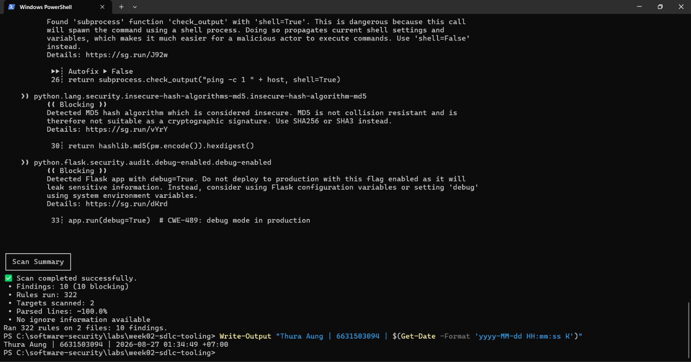
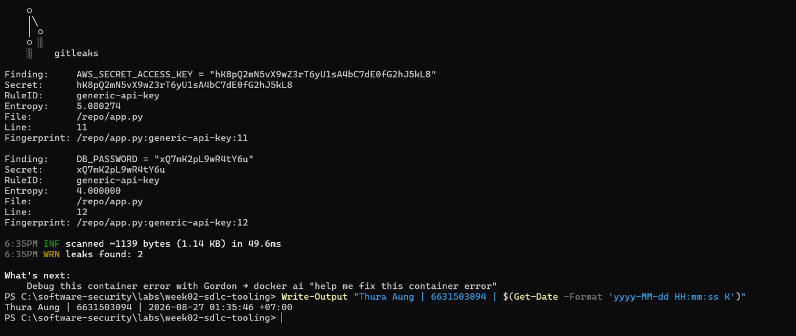
**Task 1 — SAST sweep with Semgrep (25 min)** · *Goal:* find code flaws. *Steps:* read the Semgrep output; locate the SQL injection in `/user` (CWE-89, string-formatted query), the OS command injection in `/ping` (CWE-78, `shell=True`), the weak `md5` password hash (CWE-327), and `debug=True` (CWE-489). *Deliverable:* one screenshot per finding with the file:line.

(Task 1)
- CWE-89, string-formatted query
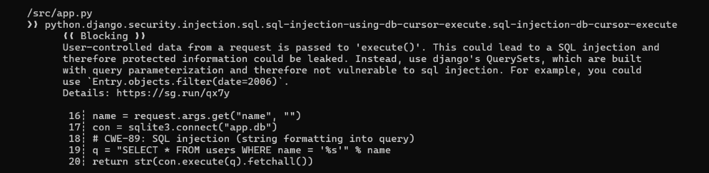
- CWE-78, shell=True
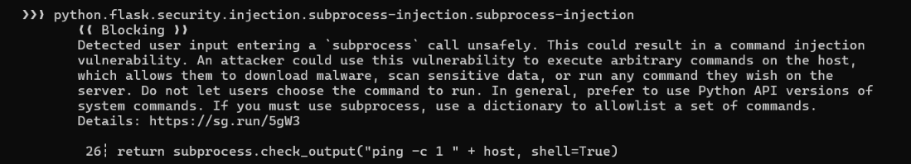
- CWE-327
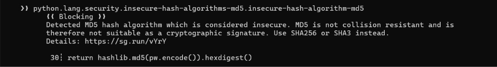
- CWE-489
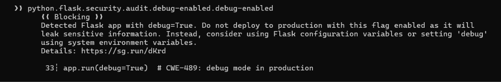

**Task 2 — Secret scan with Gitleaks (15 min)** · *Goal:* find leaked credentials. *Steps:* read the Gitleaks output; identify `AWS_SECRET_ACCESS_KEY` and `DB_PASSWORD` (CWE-798). *Deliverable:* screenshot + the rule that fired for each.

(Task 2)
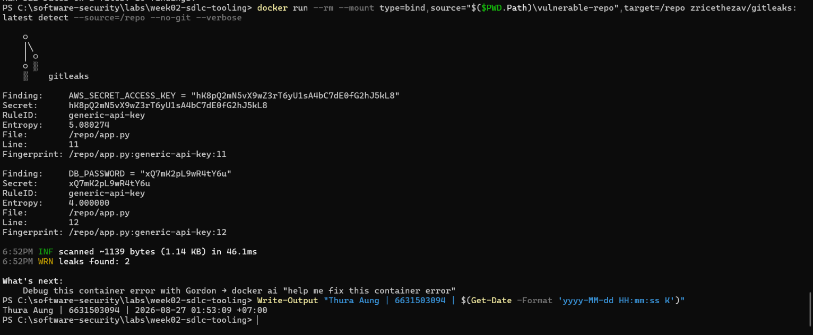

Secret Scan with Gitleaks
| Leaked credential       | File and line | Rule fired        | CWE     |
| ----------------------- | ------------- | ----------------- | ------- |
| `AWS_SECRET_ACCESS_KEY` | `app.py:11`   | `generic-api-key` | CWE-798 |
| `DB_PASSWORD`           | `app.py:12`   | `generic-api-key` | CWE-798 |

Result: Gitleaks successfully detected two hardcoded credentials. Both findings triggered the generic-api-key rule.

Mitigation: Remove the credentials from the source code and load them from environment variables or a secrets manager. Revoke and rotate any exposed credentials, and enable secret scanning in the CI pipeline to prevent future leaks.

**Task 3 — Bug Triage Race (30 min)** · *Goal:* triage accurately. *Steps:* build a table with columns *Tool | File:Line | CWE | Severity | TP/FP | Fix idea*; mark at least 3 true positives and 1 likely false positive and justify each. (Score = TP − misclassified.) *Deliverable:* the completed triage table.

(Task 3)
| Tool     | File:Line      | CWE     | Severity | TP/FP                                                                                                                                                                                                                   | Fix idea                                                                                    |
| -------- | -------------- | ------- | -------- | ----------------------------------------------------------------------------------------------------------------------------------------------------------------------------------------------------------------------- | ------------------------------------------------------------------------------------------- |
| Semgrep  | `app.py:19–20` | CWE-89  | Critical | **TP** — User input is inserted directly into an SQL query.                                                                                                                                                             | Use `con.execute("SELECT * FROM users WHERE name = ?", (name,))`.                           |
| Semgrep  | `app.py:26`    | CWE-78  | Critical | **TP** — User-controlled `host` enters a command with `shell=True`.                                                                                                                                                     | Remove `shell=True`, pass arguments as a list, and validate the host.                       |
| Semgrep  | `app.py:30`    | CWE-327 | High     | **TP** — MD5 is being used for password hashing.                                                                                                                                                                        | Replace MD5 with Argon2id, bcrypt, or scrypt with a unique salt.                            |
| Semgrep  | `app.py:33`    | CWE-489 | High     | **TP** — Flask is explicitly started with debug mode enabled.                                                                                                                                                           | Disable debug mode in production and control it through environment configuration.          |
| Gitleaks | `app.py:11`    | CWE-798 | Critical | **TP** — An AWS secret key is hardcoded in the source code.                                                                                                                                                             | Remove and rotate the key, then load it from a secrets manager or environment variable.     |
| Gitleaks | `app.py:12`    | CWE-798 | High     | **TP** — The database password is hardcoded in the source code.                                                                                                                                                         | Remove and rotate the password, then store it securely outside the repository.              |
| Semgrep  | `app.py:20`    | CWE-89  | Blocking | **Likely FP** — The `sqlalchemy-execute-raw-query` rule fired, but the program uses `sqlite3`, not SQLAlchemy. The underlying SQL injection is real, but this particular SQLAlchemy-specific warning is not applicable. | No separate fix is needed; parameterizing the real SQLite query fixes the underlying issue. |


**Task 4 — Fuzzing intro (10 min)** · *Goal:* see coverage-guided fuzzing find a bug SAST won't. *Steps:* in the `labs/toolbox` container (Apple clang has no libFuzzer runtime), build `clang -g -fsanitize=address,fuzzer harness.c -o fuzz`, then **seed the corpus** and run it:
`mkdir -p corpus && printf 'FUZ' > corpus/seed && ./fuzz corpus`. It crashes almost immediately with an AddressSanitizer heap-buffer-overflow at `harness.c:23` (the `data[3]` read with no `size > 3` check). Seeding matters: an unseeded `./fuzz` has to rediscover the magic bytes by chance and often finds nothing for minutes — that unpredictability is itself worth a sentence in your write-up. (The deep fuzzing+exploit lab is Week 11.) *Deliverable:* the ASan crash output (or a screenshot) + a 2-sentence note on why fuzzing finds this bug when a linter/SAST pass over the same 4-line check would not.

(Task 4)
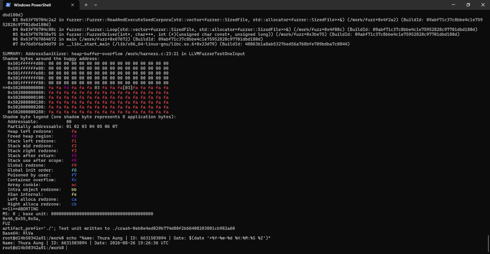
- Coverage-guided fuzzing executes mutated inputs, and the FUZ seed quickly reaches the vulnerable branch where AddressSanitizer detects the out-of-bounds data[3] read. A linter or SAST tool may not model this exact runtime input-size condition, while an unseeded fuzzer must rediscover the magic bytes by chance and may find nothing for several minutes.

**Task 5 — Scan the project target (40 min)** · *Goal:* apply the tools to your term project. *Steps:* run Semgrep + Gitleaks against **NoteVault** (`../../project/starter-app`); also run an SCA scan: `docker run --rm -v "$PWD/../../project/starter-app:/src" aquasec/trivy fs /src`. *Deliverable:* a findings list (tool, file:line/CVE, CWE) — reuse it in your project vuln report.

(Task 5)
- Semgrep scan result
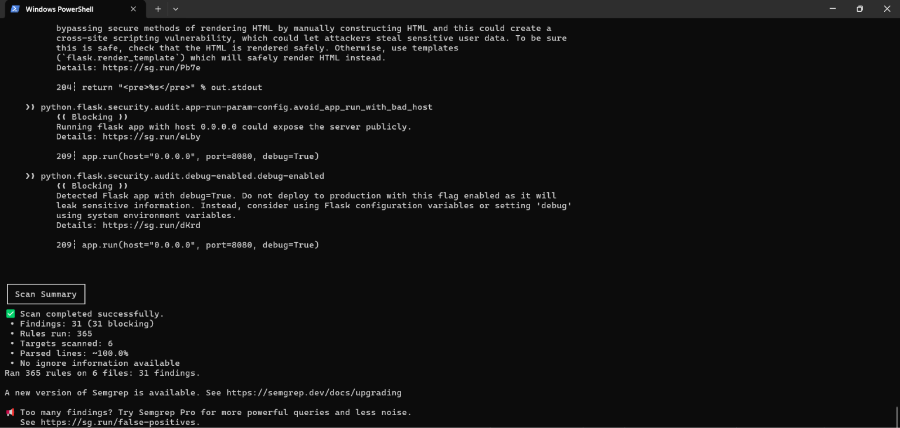

- Gitleaks scan result
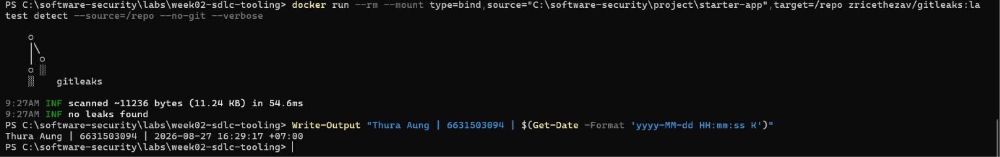

- SCA scan
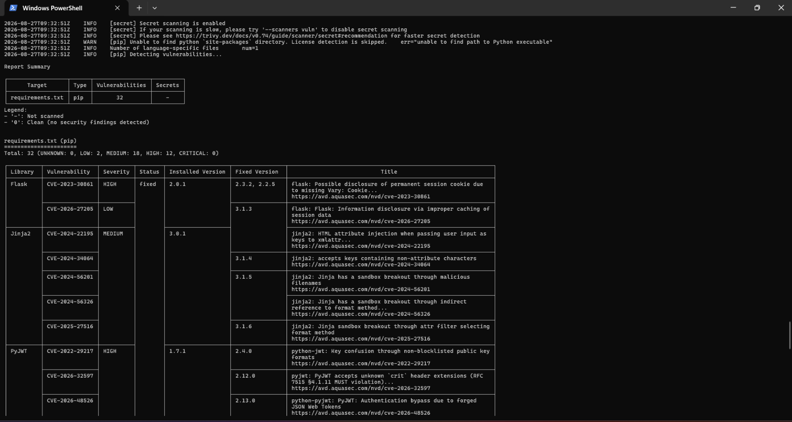

- Semgrep findings
(Duplicate Semgrep alerts were consolidated into distinct vulnerabilities.)

| Tool    | File:Line              | Finding                                 | CWE                |
| ------- | ---------------------- | --------------------------------------- | ------------------ |
| Semgrep | `Dockerfile:12`        | Container may run as root               | CWE-250            |
| Semgrep | `app.py:68–69,117,129` | MD5 password hashing                    | CWE-916 / CWE-327  |
| Semgrep | `app.py:83`            | JWT accepts the `none` algorithm        | CWE-347            |
| Semgrep | `app.py:106`           | Potential unsafe template rendering     | CWE-79             |
| Semgrep | `app.py:128–130`       | SQL injection in login query            | CWE-89             |
| Semgrep | `app.py:134`           | Hardcoded JWT signing secret            | CWE-798            |
| Semgrep | `app.py:136`           | Cookie missing security attributes      | CWE-614 / CWE-1004 |
| Semgrep | `app.py:176–179`       | SQL injection in note search            | CWE-89             |
| Semgrep | `app.py:181–182`       | User data inserted into raw HTML        | CWE-79             |
| Semgrep | `app.py:202–203`       | OS command injection using `shell=True` | CWE-78             |
| Semgrep | `app.py:204`           | Unescaped formatted response            | CWE-79             |
| Semgrep | `app.py:209`           | Application exposed on all interfaces   | CWE-668            |
| Semgrep | `app.py:209`           | Flask debug mode enabled                | CWE-489            |

- Trivy SCA findings
(All findings came from outdated packages in requirements.txt.)

| Package  | CVE                                                               | Severity | CWE                |
| -------- | ----------------------------------------------------------------- | -------: | ------------------ |
| Flask    | [CVE-2023-30861](https://nvd.nist.gov/vuln/detail/CVE-2023-30861) |     High | CWE-539            |
| Flask    | [CVE-2026-27205](https://nvd.nist.gov/vuln/detail/CVE-2026-27205) |      Low | CWE-524            |
| Jinja2   | [CVE-2024-22195](https://nvd.nist.gov/vuln/detail/CVE-2024-22195) |   Medium | CWE-79             |
| Jinja2   | [CVE-2024-34064](https://nvd.nist.gov/vuln/detail/CVE-2024-34064) |   Medium | CWE-79             |
| Jinja2   | [CVE-2024-56201](https://nvd.nist.gov/vuln/detail/CVE-2024-56201) |   Medium | CWE-150            |
| Jinja2   | [CVE-2024-56326](https://nvd.nist.gov/vuln/detail/CVE-2024-56326) |   Medium | CWE-693 / CWE-1336 |
| Jinja2   | [CVE-2025-27516](https://nvd.nist.gov/vuln/detail/CVE-2025-27516) |   Medium | CWE-1336           |
| PyJWT    | [CVE-2022-29217](https://nvd.nist.gov/vuln/detail/CVE-2022-29217) |     High | CWE-327            |
| PyJWT    | [CVE-2026-32597](https://nvd.nist.gov/vuln/detail/CVE-2026-32597) |     High | CWE-345 / CWE-347  |
| PyJWT    | [CVE-2026-48526](https://nvd.nist.gov/vuln/detail/CVE-2026-48526) |     High | CWE-287 / CWE-347  |
| Werkzeug | [CVE-2023-25577](https://nvd.nist.gov/vuln/detail/CVE-2023-25577) |     High | CWE-770            |
| Werkzeug | [CVE-2024-34069](https://nvd.nist.gov/vuln/detail/CVE-2024-34069) |     High | CWE-352            |
| Werkzeug | [CVE-2023-46136](https://nvd.nist.gov/vuln/detail/CVE-2023-46136) |   Medium | CWE-400 / CWE-407  |
| Werkzeug | [CVE-2024-49766](https://nvd.nist.gov/vuln/detail/CVE-2024-49766) |   Medium | CWE-22             |
| Werkzeug | [CVE-2024-49767](https://nvd.nist.gov/vuln/detail/CVE-2024-49767) |   Medium | CWE-400 / CWE-770  |
| Werkzeug | [CVE-2025-66221](https://nvd.nist.gov/vuln/detail/CVE-2025-66221) |   Medium | CWE-67             |
| Werkzeug | [CVE-2026-21860](https://nvd.nist.gov/vuln/detail/CVE-2026-21860) |   Medium | CWE-67             |
| Werkzeug | [CVE-2026-27199](https://nvd.nist.gov/vuln/detail/CVE-2026-27199) |   Medium | CWE-67             |
| Werkzeug | [CVE-2023-23934](https://nvd.nist.gov/vuln/detail/CVE-2023-23934) |      Low | CWE-20             |
| requests | [CVE-2023-32681](https://nvd.nist.gov/vuln/detail/CVE-2023-32681) |   Medium | CWE-200            |
| requests | [CVE-2024-35195](https://nvd.nist.gov/vuln/detail/CVE-2024-35195) |   Medium | CWE-670            |
| requests | [CVE-2024-47081](https://nvd.nist.gov/vuln/detail/CVE-2024-47081) |   Medium | CWE-522            |
| requests | [CVE-2026-25645](https://nvd.nist.gov/vuln/detail/CVE-2026-25645) |   Medium | CWE-377            |
| urllib3  | [CVE-2021-33503](https://nvd.nist.gov/vuln/detail/CVE-2021-33503) |     High | CWE-400            |
| urllib3  | [CVE-2023-43804](https://nvd.nist.gov/vuln/detail/CVE-2023-43804) |     High | CWE-200            |
| urllib3  | [CVE-2025-66418](https://nvd.nist.gov/vuln/detail/CVE-2025-66418) |     High | CWE-770            |
| urllib3  | [CVE-2025-66471](https://nvd.nist.gov/vuln/detail/CVE-2025-66471) |     High | CWE-409            |
| urllib3  | [CVE-2026-21441](https://nvd.nist.gov/vuln/detail/CVE-2026-21441) |     High | CWE-409            |
| urllib3  | [CVE-2026-44431](https://nvd.nist.gov/vuln/detail/CVE-2026-44431) |     High | CWE-200            |
| urllib3  | [CVE-2023-45803](https://nvd.nist.gov/vuln/detail/CVE-2023-45803) |   Medium | CWE-200            |
| urllib3  | [CVE-2024-37891](https://nvd.nist.gov/vuln/detail/CVE-2024-37891) |   Medium | CWE-669            |
| urllib3  | [CVE-2025-50181](https://nvd.nist.gov/vuln/detail/CVE-2025-50181) |   Medium | CWE-601            |

**Task 6 — Build a security CI gate (25 min)** · *Goal:* automate the scan (previews Week 15). *Steps:* adapt `../week15-devsecops-pipeline/security-ci.yml` into a workflow that runs Semgrep + Trivy + Gitleaks and **fails on HIGH/CRITICAL**; run it locally (`act`) or commit to your fork and read the Actions log. *Deliverable:* the workflow file + a screenshot of a failing run.

(Task 6)
- the workflow file
```bash
name: NoteVault Security CI

on:
  push:
    branches: [main]
    paths:
      - "project/starter-app/**"
      - ".github/workflows/notevault-security-ci.yml"
  pull_request:
    branches: [main]
  workflow_dispatch:

permissions:
  contents: read

jobs:
  security-gate:
    name: Semgrep + Trivy + Gitleaks
    runs-on: ubuntu-latest

    steps:
      - name: Check out repository
        uses: actions/checkout@v4

      - name: Run Semgrep SAST
        id: semgrep
        continue-on-error: true
        run: |
          docker run --rm \
            -v "$PWD/project/starter-app:/src" \
            semgrep/semgrep:latest \
            semgrep scan \
            --config p/default \
            --config p/owasp-top-ten \
            --error /src

      - name: Run Trivy SCA gate
        id: trivy
        continue-on-error: true
        uses: aquasecurity/trivy-action@ed142fd0673e97e23eac54620cfb913e5ce36c25
        with:
          scan-type: fs
          scan-ref: project/starter-app
          scanners: vuln
          severity: HIGH,CRITICAL
          ignore-unfixed: false
          exit-code: "1"

      - name: Run Gitleaks secret scan
        id: gitleaks
        continue-on-error: true
        run: |
          docker run --rm \
            -v "$PWD/project/starter-app:/repo" \
            zricethezav/gitleaks:latest \
            detect \
            --source=/repo \
            --no-git \
            --verbose \
            --exit-code 1

      - name: Enforce security gate
        if: always()
        env:
          SEMGREP_OUTCOME: ${{ steps.semgrep.outcome }}
          TRIVY_OUTCOME: ${{ steps.trivy.outcome }}
          GITLEAKS_OUTCOME: ${{ steps.gitleaks.outcome }}
        run: |
          echo "Semgrep: $SEMGREP_OUTCOME"
          echo "Trivy: $TRIVY_OUTCOME"
          echo "Gitleaks: $GITLEAKS_OUTCOME"

          if [[ "$SEMGREP_OUTCOME" == "failure" ||
                "$TRIVY_OUTCOME" == "failure" ||
                "$GITLEAKS_OUTCOME" == "failure" ]]; then
            echo "::error::Security gate failed because vulnerabilities or secrets were detected."
            exit 1
          fi

          echo "Security gate passed."
```
[NoteVault security CI gate failing on security findings]
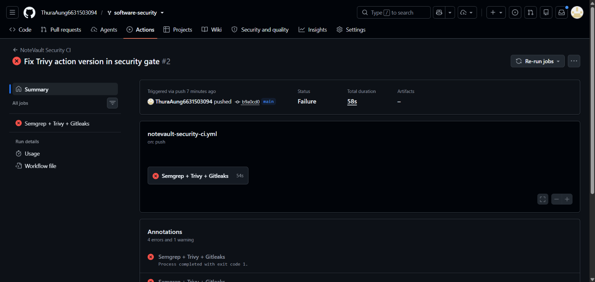

**Task 7 — SAST blind spots (20 min)** · *Goal:* see what scanners miss. *Steps:* find one real bug in `vulnerable-repo/app.py` (or NoteVault) that Semgrep did **not** flag, and explain why a pattern-based tool missed it. *Deliverable:* the bug + a 2-sentence explanation.

(Task 7)

- Bug: IDOR / broken object-level authorization in project/starter-app/app.py:161–168 (CWE-639). The /api/notes/<nid> endpoint checks only whether the requester is logged in, but it does not verify that the requested note belongs to that user.

- Explanation

>Semgrep missed this because the SQL query is parameterized and does not match a dangerous injection pattern. Detecting the bug requires understanding the application’s authorization rule—that users should access only their own notes—which a pattern-based scanner may not know.

**Task 8 — Defend / fix it (10 min)** · *Goal:* remediate the planted flaws in `vulnerable-repo/app.py`. *Steps:* rewrite `/user` to use a parameterized query (`?` placeholder); remove `shell=True` and pass an argument list in `/ping`; move both secrets to environment variables; replace `md5` with bcrypt/argon2; set `debug=False`. *Deliverable:* a before/after diff for each fix mapped to its CWE.

(Task 8)

- Fixed code
```bash
"""
Secured Week 2 sample application.
"""

import ipaddress
import os
import sqlite3
import subprocess

from argon2 import PasswordHasher
from flask import Flask, request

app = Flask(__name__)
password_hasher = PasswordHasher()

# CWE-798 fixed: secrets are loaded from environment variables.
AWS_SECRET_ACCESS_KEY = os.environ["AWS_SECRET_ACCESS_KEY"]
DB_PASSWORD = os.environ["DB_PASSWORD"]


@app.route("/user")
def user():
    name = request.args.get("name", "")
    con = sqlite3.connect("app.db")

    # CWE-89 fixed: parameterized SQL query.
    rows = con.execute(
        "SELECT * FROM users WHERE name = ?",
        (name,),
    ).fetchall()

    con.close()
    return str(rows)


@app.route("/ping")
def ping():
    supplied_host = request.args.get("host", "127.0.0.1")

    try:
        host = str(ipaddress.ip_address(supplied_host))
    except ValueError:
        return "Invalid IP address", 400

    # CWE-78 fixed: validated input, argument list, and no shell=True.
    return subprocess.check_output(
        ["ping", "-c", "1", host],
        text=True,
    )


def store_password(password):
    # CWE-916/CWE-327 fixed: PasswordHasher uses Argon2id.
    return password_hasher.hash(password)


if __name__ == "__main__":
    app.run(debug=False)  # CWE-489 fixed
```
- Before/after fixes

| CWE               | Before                                          | After                                                             |
| ----------------- | ----------------------------------------------- | ----------------------------------------------------------------- |
| CWE-89            | `q = "SELECT ... '%s'" % name`                  | `con.execute("SELECT ... ?", (name,))`                            |
| CWE-78            | `check_output("ping -c 1 " + host, shell=True)` | Validate the IP and use `check_output(["ping", "-c", "1", host])` |
| CWE-798           | Secrets stored directly in `app.py`             | Load both secrets with `os.environ[...]`                          |
| CWE-916 / CWE-327 | `hashlib.md5(pw.encode()).hexdigest()`          | `PasswordHasher().hash(password)` using Argon2id                  |
| CWE-489           | `app.run(debug=True)`                           | `app.run(debug=False)`                                            |

## Part 4 — Reflection
1. Map two of your findings to their CWE and to the matching OWASP 2025 category.
> The SQL injection in /user maps to CWE-89 and OWASP 2025 A05: Injection. The hardcoded AWS key and database password map to CWE-798 and OWASP 2025 A07: Authentication Failures.
2. Name a real-world breach caused by a hardcoded/leaked secret or an injection flaw, and what control would have caught it pre-release.
> In Uber’s 2016 breach, attackers found an AWS access key stored in a private GitHub repository and used it to access data in Amazon S3. Automated secret scanning on every commit and pull request could have detected and blocked the exposed key before release.
3. Which single tool (SAST vs. secret scanning) gave the highest-value findings on this repo, and why?
> SAST provided the highest-value findings because Semgrep identified several directly exploitable weaknesses, including SQL injection, command injection, insecure MD5 password hashing, and debug mode. Secret scanning was still valuable, but SAST revealed more distinct vulnerabilities and explained the unsafe code lines that required correction.

## Grading rubric (100)
| Criterion | Points |
|---|---|
| Lecture questions (Part 2) | 20 |
| Exploitation + evidence (scan output + triage table + screenshots) | 40 |
| Defense (remediated `app.py` with before/after diffs) | 25 |
| Reflection (CWE/OWASP mapping + breach + tool value) | 15 |

---

## Evidence & Integrity (required)

- **Identity proof:** every screenshot/diagram must show a terminal running `printf '%s | %s | ' "$(whoami)" '<YOUR-STUDENT-ID>'; date '+%F %T %Z'` **in the
  same image as the evidence**. When the evidence is a browser page, a DevTools panel or a
  rendered response, put that terminal **beside the browser and capture the whole screen** — a
  cropped window carries nothing that identifies you, and the lab's own output is
  byte-identical for the whole cohort *by design*, so the stamp is the only thing that makes
  the shot yours. Generic or borrowed evidence is not accepted.
- **Personalized flag (if this lab issues one):** ____________________
  *Flags are unique per student — submitting another student's flag is a violation. How to submit: **learn.zcr.ai/submit** (full guide: `SUBMISSION.md` in the repo root).*
- **Explain in your own words** *(graded on your reasoning, not copied text):*
  1. What did you do, and **why did the vulnerability work**?
  2. **Why does your fix actually stop it** — and what could still break it?

---

## 🤖 Audit the AI (required)

AI is a power tool you must **distrust** — you are graded on your *critique*, not the AI's answer.

1. Ask an AI assistant to exploit **or** fix this week's vulnerability. Paste its full answer.
---
1. AI assistant’s full answer
- To fix the SQL injection, escape single quotation marks before adding the username to the query:
```bash
@app.route("/user")
def user():
    name = request.args.get("name", "")
    safe_name = name.replace("'", "''")
    con = sqlite3.connect("app.db")
    q = f"SELECT * FROM users WHERE name = '{safe_name}'"
    return str(con.execute(q).fetchall())
```
- Escaping quotation marks prevents attackers from breaking out of the SQL string.
---
2. **Find what's wrong or risky** in it — insecure code, a subtly incomplete fix, a hallucinated API/function/CVE, a missed edge case, or wrong reasoning. Quote the exact line(s).
---
2. What is wrong or risky
- The risky lines are:
```bash
safe_name = name.replace("'", "''")
q = f"SELECT * FROM users WHERE name = '{safe_name}'"
```
---
3. Produce the **correct, verified** version yourself and explain in 2–3 sentences why the AI's output was insufficient.
---
3. Correct, verified version

```bash
@app.route("/user")
def user():
    name = request.args.get("name", "")
    con = sqlite3.connect("app.db")
    rows = con.execute(
        "SELECT * FROM users WHERE name = ?",
        (name,),
    ).fetchall()
    con.close()
    return str(rows)
```
  > The AI’s fix was insufficient because it continued mixing user input with SQL and relied on hand-written escaping. The parameterized version sends the query and username separately, so malicious text is treated only as data. After verification, the SQL-injection Semgrep warning disappeared, and the payload ' OR 1=1 -- no longer returned unintended users.

> Disclose your AI use in the Part 1 table. This task counts toward your **Defense + Reflection** score.

---

## 🧠 Comprehension & Prompt (required)

**A. Explain in Plain English (EiPE).** In 2–3 sentences, in your own words, describe what this week's vulnerable code/endpoint actually *does* and *why it is exploitable* — explain the mechanism, don't dump jargon.

- The /user endpoint takes a name from the URL and searches the database for a matching user. The vulnerable version inserted that input directly into the SQL command, so an attacker could submit SQL syntax such as ' OR 1=1 -- and make the database return records they were not supposed to see.

**B. Prompt Problem.** Write a **single prompt** that makes an AI produce a *correct, secure* fix for one finding. Run it: does the exploit now fail? If not, refine the prompt and try again. Submit the **final prompt + the verified result**.
*Graded on the prompt's precision and your verification — this trains problem decomposition and AI literacy (Denny et al. 2024).*

- Final prompt given to the AI:
>Fix only the SQL injection vulnerability in the Flask /user endpoint. Use Python’s sqlite3 parameterized-query syntax with a literal ? placeholder and pass name as the one-element tuple (name,). Do not use string formatting, concatenation, f-strings, manual escaping, or an ORM. Preserve the endpoint’s existing behavior, fetch the results, close the database connection, and return the corrected Python code.

AI-generated secure fix:
```bash
@app.route("/user")
def user():
    name = request.args.get("name", "")
    con = sqlite3.connect("app.db")

    rows = con.execute(
        "SELECT * FROM users WHERE name = ?",
        (name,),
    ).fetchall()

    con.close()
    return str(rows)
```
Verified result:

I tested the fixed endpoint with the payload ' OR 1=1 --. It returned [] instead of returning every database record, while the normal input alice returned only Alice’s record; therefore, the SQL injection exploit failed. A new Semgrep scan also no longer reported the original CWE-89 SQL-injection finding.