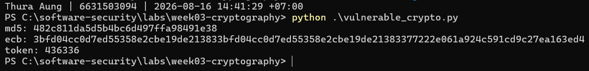
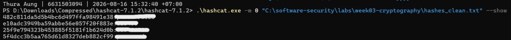
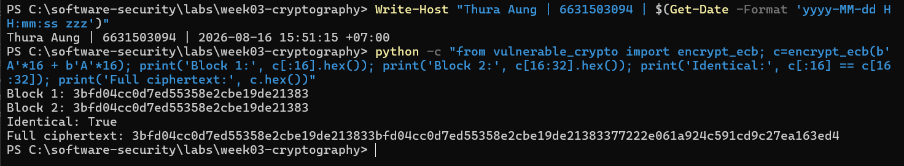
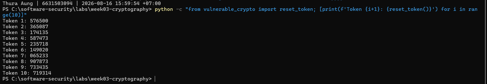
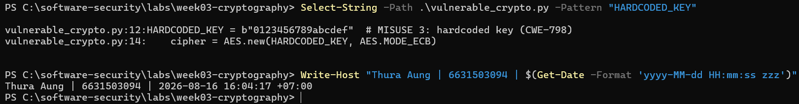
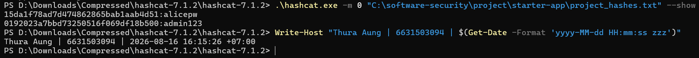

# Worksheet 3 — Cryptography Used Correctly (and Misused) (3 hrs)

> **Course:** Software Security (KOSEN69) · **Week 3**
> **Aligned to:** OWASP 2025 A04 Cryptographic Failures · CWE-327, CWE-916, CWE-330, CWE-798
> **Signature game:** "Capture the Hash" (recover plaintext from weak hashes)

> **Ethics note:** Crack only the hashes provided in `hashes.txt` on your own machine. Password-cracking against accounts or systems you don't own is illegal. Wordlists and recovered values stay inside the lab VM.

## Part 1 — Student Information
| Name | Student ID | Date | Group |
|---|---|---|---|
| Thura Aung | 6631503094 | 16.8.2026 | |

## Part 2 — Lecture Questions
Answer in your own words (2–4 sentences each).
1. Distinguish hashing, encryption, and encoding — and give one job each is the wrong tool for.
2. Why is a fast hash like MD5/SHA-1 a bad choice for storing passwords, and what should be used instead?
3. What is a salt, what attack does it defeat, and why must it be unique per password?
4. Why does AES-ECB leak structure, and what does an authenticated mode like AES-GCM add?
5. What's the difference between `random` and a CSPRNG (e.g. `secrets`), and where does it matter?

1.     Hashing, encryption, and encoding:Hashing turns data into a fixed value and is mainly used for checking integrity or storing passwords securely. Encryption hides data using a key and can be reversed, while encoding only changes the format of data. Hashing is wrong for data you need to recover, encryption is wrong for password storage, and encoding is wrong for protecting sensitive information.
2.     MD5/SHA-1 for passwords:MD5 and SHA-1 are very fast, so attackers can try millions of password guesses quickly. Passwords should use slow password-hashing algorithms such as Argon2id, bcrypt, or scrypt.
3.     Salt:A salt is a random value added to a password before hashing. It prevents attackers from easily using precomputed tables such as rainbow tables. Each password needs a unique salt so identical passwords do not produce identical hashes.
4.     AES-ECB vs AES-GCM:AES-ECB encrypts identical blocks into identical ciphertext blocks, so patterns in the original data can still be visible. AES-GCM hides these patterns and also checks that the encrypted data has not been changed.
5.     random vs CSPRNG:random is designed for simulations and normal applications, not for security, because its output may be predictable. A CSPRNG such as Python's secrets produces much harder-to-predict values and should be used for passwords, reset tokens, session IDs, and security keys.


## Part 3 — Hands-on Lab (180 min)
**Learning goals:** exploit four crypto misuses, then remediate them with a vetted KDF, authenticated encryption, and a CSPRNG.
**Prerequisites:** Docker (or local Python 3.12); `hashcat` or `john`; the `rockyou.txt` wordlist.

**Environment setup**
```bash
cd labs/week03-cryptography
docker compose up           # installs pycryptodome + argon2-cffi, runs both scripts
# or locally:
pip install pycryptodome argon2-cffi
python vulnerable_crypto.py # see the md5 hash, repeated ECB blocks, 6-digit token
```
Targets: `vulnerable_crypto.py` (the misuses), `hashes.txt` (four unsalted MD5s), and `solution_skeleton.py` (the fix).

**What to submit per task:** the command/payload run + a screenshot of the result + a 2–3 sentence mitigation.

**Task 0 — Onboarding (5 min)** · *Goal:* see the misuse output. *Steps:* run `python vulnerable_crypto.py`; note the md5 digest, the identical ECB ciphertext blocks, and the short token. *Deliverable:* screenshot of the program output.

(Task 0)


      The vulnerable program ran successfully and showed MD5 hashing, AES-ECB encryption, and a 6-digit random token. This confirms the insecure crypto behaviors that will be tested and fixed in the next tasks.

**Task 1 — Capture the Hash (30 min)** · *Goal:* recover the passwords. *Steps:* strip the comment lines from `hashes.txt`, then run `hashcat -m 0 hashes.txt rockyou.txt` (or the `john --format=raw-md5` equivalent); recover all four plaintexts. *Deliverable:* screenshot of the cracked results (mask any real-looking value). Note in one line why unsalted MD5 fell so fast (CWE-916/327).

```sim
aes-modes
```
(Task 1)


      Unsalted MD5 was cracked very quickly because MD5 is designed to be fast and the hashes did not use unique salts, allowing Hashcat to compare millions of common password guesses efficiently (CWE-916/327).

 Mitigation:
      Passwords should be stored using Argon2id instead of MD5. Argon2id uses salts and is intentionally slower, making password cracking much harder.     

**Task 2 — ECB structure leak (20 min)** · *Goal:* prove ECB leaks. *Steps:* call `encrypt_ecb(b"A"*16 + b"A"*16)` from `vulnerable_crypto.py` and show the two 16-byte ciphertext blocks are identical; explain how this leaks plaintext structure (CWE-327). *Deliverable:* hex output highlighting the repeated block.

(Task 2)


     AES-ECB encrypts identical 16-byte plaintext blocks into identical ciphertext blocks when the same key is used. Because of this, repeated patterns in the original data remain visible in the encrypted data, which can reveal information about the plaintext structure (CWE-327).

Mitigation:
     AES-ECB should not be used for sensitive data because it does not hide repeated patterns. An authenticated encryption mode such as AES-GCM should be used with a unique random nonce, because it provides confidentiality and also detects unauthorized modification.     

**Task 3 — Predictable token (15 min)** · *Goal:* show the reset token is guessable. *Steps:* call `reset_token()` repeatedly; argue why a 6-digit `random` token (10^6 space, non-CSPRNG) is brute-forceable (CWE-330). *Deliverable:* sample tokens + a one-line attack estimate.

(Task 3)


     The reset token contains only six decimal digits, giving just 1,000,000 possible values, and it is generated using Python's non-cryptographic random module. This makes the token unsuitable for security-sensitive authentication and potentially guessable through repeated attempts (CWE-330).

One-line attack estimate:
      A 6-digit token has only 1,000,000 possibilities; at 1,000 guesses per second, all possibilities could theoretically be tested in about 16.7 minutes, with the correct token found on average in about half that time.

Mitigation:
      Reset tokens should be generated using a cryptographically secure random generator such as Python's secrets module. The token should also have much more entropy, expire quickly, be single-use, and the application should rate-limit verification attempts.     

**Task 4 — Hardcoded key (5 min)** · *Goal:* identify the key-management flaw. *Steps:* find `HARDCODED_KEY` in `vulnerable_crypto.py`; explain why shipping a key in source is CWE-798. *Deliverable:* the line + a 2-sentence mitigation.

(Task 4)


     Storing an encryption key directly in source code is insecure because anyone who can access the source code or compiled application may recover the key. If the same key is deployed to many systems, one leaked copy can compromise all encrypted data, which is a hardcoded credential issue under CWE-798.

Mitigation:
      Encryption keys should be stored outside the source code, such as in environment variables or a dedicated secret-management system. The key should also be protected with access controls and rotated if it is exposed.

**Task 5 — Crack the project target's hashes (25 min)** · *Goal:* apply cracking to your term project. *Steps:* **NoteVault** stores unsalted MD5 password hashes; obtain them (via the app's `/admin` once you can reach it, or from its `seed()`), and crack them with `hashcat -m 0`. *Deliverable:* the recovered password(s) + note the CWE — record this finding for your project report (`project/REPORT-TEMPLATE.md` in the repo root).

(Task 5)


     NoteVault stores seeded user passwords as unsalted MD5 hashes. admin123 was recovered using RockYou, while alicepw required adding the known seed candidate to a small wordlist, showing that MD5 password storage is vulnerable to fast offline guessing (CWE-916/CWE-327).

**Task 6 — Password storage migration (25 min)** · *Goal:* fix it the way real apps do. *Steps:* write `store_password`/`verify_password` with **argon2id**, and a **rehash-on-login** path that upgrades a legacy MD5 record to argon2id the next time the user logs in. *Deliverable:* the code + a short note on why migration matters.

(Task 6)
```bash
"""
Week 3 — FIX the misuse here. Fill in the TODOs.
pip install argon2-cffi pycryptodome
"""
import os
import hashlib
import hmac
import re

from argon2 import PasswordHasher
from argon2.exceptions import VerificationError, InvalidHashError
from Crypto.Cipher import AES

ph = PasswordHasher()


# Store all NEW passwords with Argon2id
def store_password(pw: str) -> str:
    return ph.hash(pw)


# Verify an Argon2id password
def verify_password(hash_: str, pw: str) -> bool:
    try:
        return ph.verify(hash_, pw)
    except (VerificationError, InvalidHashError):
        return False


# Detect an old MD5 hash
def is_legacy_md5(hash_: str) -> bool:
    return bool(re.fullmatch(r"[0-9a-fA-F]{32}", hash_))


# Rehash-on-login migration
def verify_and_upgrade(hash_: str, pw: str):
    # Old MD5 password
    if is_legacy_md5(hash_):
        md5_candidate = hashlib.md5(pw.encode()).hexdigest()

        if not hmac.compare_digest(md5_candidate, hash_.lower()):
            return False, hash_

        # Correct password -> replace MD5 with Argon2id
        new_hash = store_password(pw)
        return True, new_hash

    # Already Argon2id
    if verify_password(hash_, pw):
        if ph.check_needs_rehash(hash_):
            return True, store_password(pw)

        return True, hash_

    return False, hash_


def encrypt_gcm(data: bytes, key: bytes) -> tuple[bytes, bytes, bytes]:
    nonce = os.urandom(12)
    cipher = AES.new(key, AES.MODE_GCM, nonce=nonce)
    ct, tag = cipher.encrypt_and_digest(data)
    return nonce, ct, tag


def reset_token() -> str:
    import secrets
    return secrets.token_urlsafe(16)


if __name__ == "__main__":
    # Simulate an OLD MD5 database record
    old_hash = hashlib.md5(b"password123").hexdigest()

    print("Before login:", old_hash)

    ok, upgraded_hash = verify_and_upgrade(old_hash, "password123")

    print("Login successful:", ok)
    print("After login:", upgraded_hash)
    print("Uses Argon2id:", upgraded_hash.startswith("$argon2id$"))

    # Verify the new Argon2id hash
    print("Argon2 verify:", verify_password(upgraded_hash, "password123"))
    
```
      Rehash-on-login lets an application gradually replace weak legacy MD5 password hashes with stronger Argon2id hashes without forcing every user to reset their password immediately. When a user successfully logs in, the application verifies the old hash and then stores a new salted Argon2id hash for future logins.
      
**Task 7 — Authenticated encryption round-trip (20 min)** · *Goal:* use AEAD correctly. *Steps:* encrypt+decrypt a message with **AES-GCM** using a random 12-byte nonce and a key from an env var; then flip one ciphertext byte and show decryption **fails** (tag check). *Deliverable:* the round-trip output + the tampered-fails proof.

**Task 8 — TLS in practice (15 min)** · *Goal:* read a real cert. *Steps:* run `openssl s_client -connect example.com:443 </dev/null 2>/dev/null | tee /tmp/tls.txt | openssl x509 -noout -issuer -subject -dates` for the cert summary, then `grep -E 'Protocol|New,' /tmp/tls.txt` for the negotiated TLS version (the version line is printed by `s_client`, not by `x509`, so the plain pipe would discard it); identify issuer, validity, and that TLS version. *Deliverable:* the cert summary + one line on what TLS protects that hashing/at-rest encryption does not.

**Task 9 — Defend / fix it (20 min)** · *Goal:* remediate using `solution_skeleton.py`. *Steps:* run `python solution_skeleton.py`; confirm `store_password`/`verify_password` use argon2id (auto-salted), `encrypt_gcm` uses a random 12-byte nonce + auth tag with a key from `ENC_KEY_HEX` env, and `reset_token` uses `secrets`. Map each fix to the CWE it closes. *Deliverable:* before/after table (misuse → fix → CWE closed) + screenshot of the fixed script running.

## Part 4 — Reflection
1. Map each of the four misuses to its CWE and to OWASP A04, in one line each.
2. Name a real-world breach caused by weak password hashing or hardcoded keys, and which fix here would have prevented it.
3. Across all four fixes, which closes the largest real-world risk, and why?

## Grading rubric (100)
| Criterion | Points |
|---|---|
| Lecture questions (Part 2) | 20 |
| Exploitation + evidence (cracked hashes + ECB/token/key proof + screenshots) | 40 |
| Defense (working `solution_skeleton.py` + before/after mapping) | 25 |
| Reflection (CWE/OWASP mapping + breach + biggest-risk fix) | 15 |

---

## Evidence & Integrity (required)

- **Identity proof:** every screenshot/diagram must show a terminal running `printf '%s | %s | ' "$(whoami)" '<YOUR-STUDENT-ID>'; date '+%F %T %Z'` **in the
  same image as the evidence**. When the evidence is a browser page, a DevTools panel or a
  rendered response, put that terminal **beside the browser and capture the whole screen** — a
  cropped window carries nothing that identifies you, and the lab's own output is
  byte-identical for the whole cohort *by design*, so the stamp is the only thing that makes
  the shot yours. Generic or borrowed evidence is not accepted.
- **Personalized flag (if this lab issues one):** ____________________
  *Flags are unique per student — submitting another student's flag is a violation. How to submit: **learn.zcr.ai/submit** (full guide: `SUBMISSION.md` in the repo root).*
- **Explain in your own words** *(graded on your reasoning, not copied text):*
  1. What did you do, and **why did the vulnerability work**?
  2. **Why does your fix actually stop it** — and what could still break it?

---

## 🤖 Audit the AI (required)

AI is a power tool you must **distrust** — you are graded on your *critique*, not the AI's answer.

1. Ask an AI assistant to exploit **or** fix this week's vulnerability. Paste its full answer.
2. **Find what's wrong or risky** in it — insecure code, a subtly incomplete fix, a hallucinated API/function/CVE, a missed edge case, or wrong reasoning. Quote the exact line(s).
3. Produce the **correct, verified** version yourself and explain in 2–3 sentences why the AI's output was insufficient.

> Disclose your AI use in the Part 1 table. This task counts toward your **Defense + Reflection** score.

---

## 🧠 Comprehension & Prompt (required)

**A. Explain in Plain English (EiPE).** In 2–3 sentences, in your own words, describe what this week's vulnerable code/endpoint actually *does* and *why it is exploitable* — explain the mechanism, don't dump jargon.

**B. Prompt Problem.** Write a **single prompt** that makes an AI produce a *correct, secure* fix for one finding. Run it: does the exploit now fail? If not, refine the prompt and try again. Submit the **final prompt + the verified result**.
*Graded on the prompt's precision and your verification — this trains problem decomposition and AI literacy (Denny et al. 2024).*
